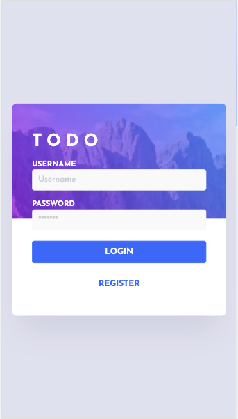
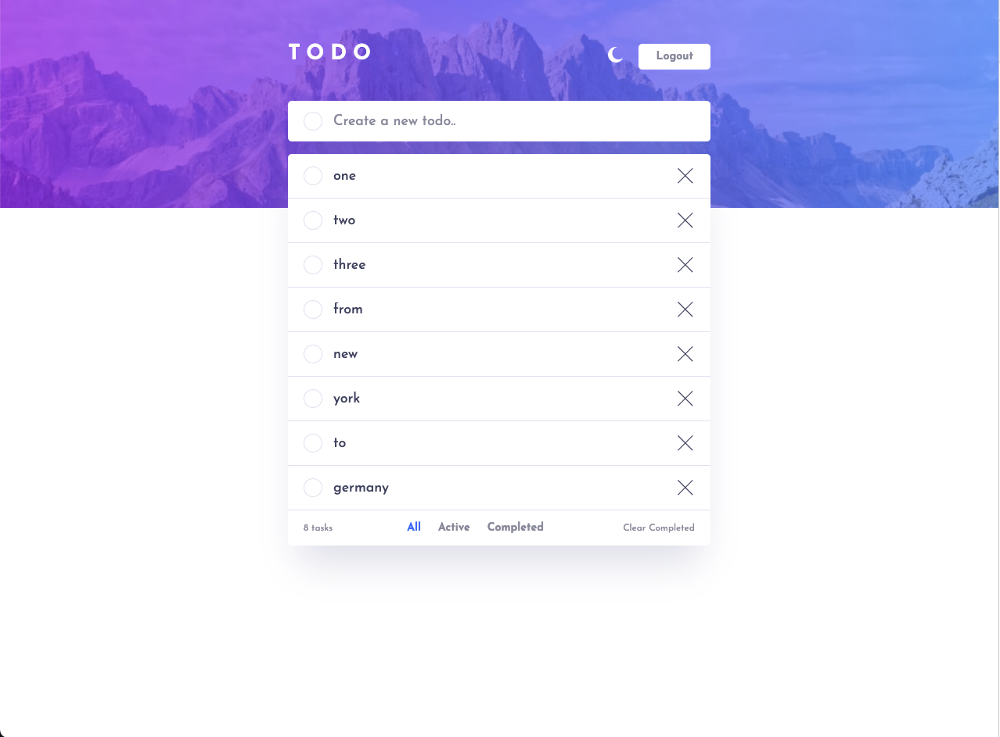
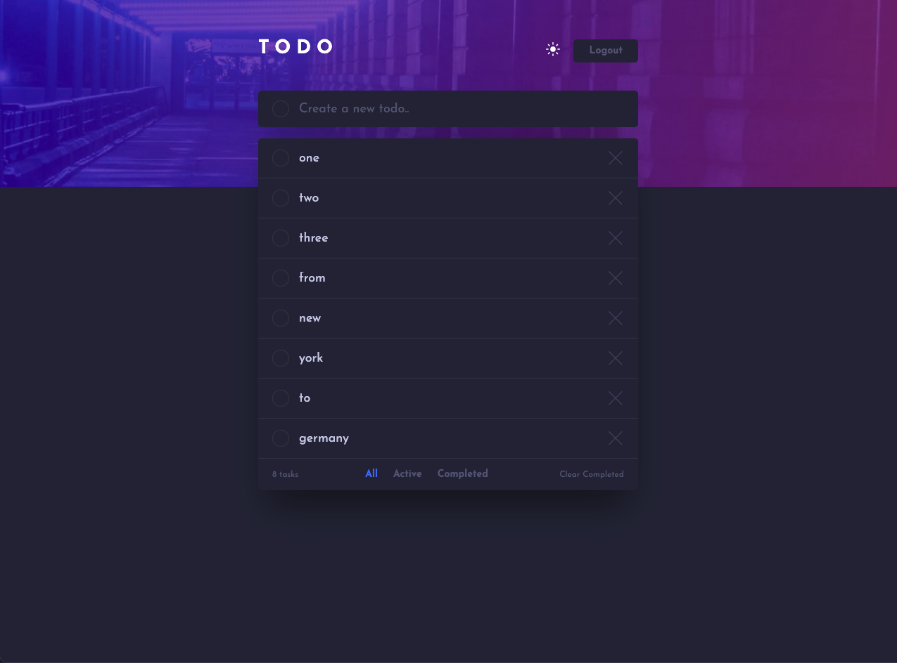
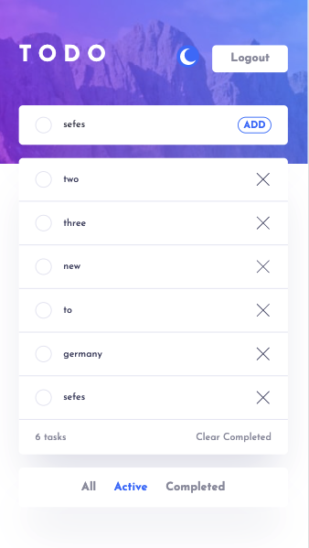
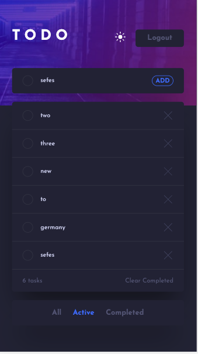

# Frontend Mentor - Todo app solution

This is a solution to the [Todo app challenge on Frontend Mentor](https://www.frontendmentor.io/challenges/todo-app-Su1_KokOW). Frontend Mentor challenges help you improve your coding skills by building realistic projects.

## Table of contents

- [Frontend Mentor - Todo app solution](#frontend-mentor---todo-app-solution)
  - [Table of contents](#table-of-contents)
  - [Overview](#overview)
    - [The challenge](#the-challenge)
    - [Screenshots](#screenshots)
    - [Links](#links)
  - [My process](#my-process)
    - [Built with](#built-with)
    - [What I learned](#what-i-learned)
    - [Useful resources](#useful-resources)
  - [Author](#author)

**Note: Delete this note and update the table of contents based on what sections you keep.**

## Overview

### The challenge

Users should be able to:

- View the optimal layout for the app depending on their device's screen size
- See hover states for all interactive elements on the page
- Add new todos to the list
- Mark todos as complete
- Delete todos from the list
- Filter by all/active/complete todos
- Clear all completed todos
- Toggle light and dark mode
- **Bonus**: Drag and drop to reorder items on the list

### Screenshots

### Links

- Solution URL: [Add solution URL here](https://github.com/FocusCookie/fm-todo-app-react-api/)
- Live Site URL: [Add live site URL here](https://focuscookie.github.io/fm-todo-app-react-api/)

## My process

### Built with

- Semantic HTML5 markup
- CSS custom properties
- Flexbox
- Mobile-first workflow
- [React](https://reactjs.org/)
- [Storybook](https://storybook.js.org/)

### What I learned

React has not scoped css styles. For that reason you should use styled components or a css framework to create component classes.

That a build react app cant be hostet with the default settings of the vscode plugin live-server. You should use serve in the terminal instead. Also to host the app on github pages follow this article
[How to host react app on github pages](https://dev.to/yuribenjamin/how-to-deploy-react-app-in-github-pages-2a1f).

### Useful resources

- [How to host react app on github pages](https://dev.to/yuribenjamin/how-to-deploy-react-app-in-github-pages-2a1f).
- [Free Todo API](https://documenter.getpostman.com/view/8858534/SW7dX7JG#b7508760-058c-4d0d-8b2c-a89f7df0d42e) - An free api for a small todo app.

## Author

- Frontend Mentor - [@focuscookie](https://www.frontendmentor.io/profile/focuscookie)
